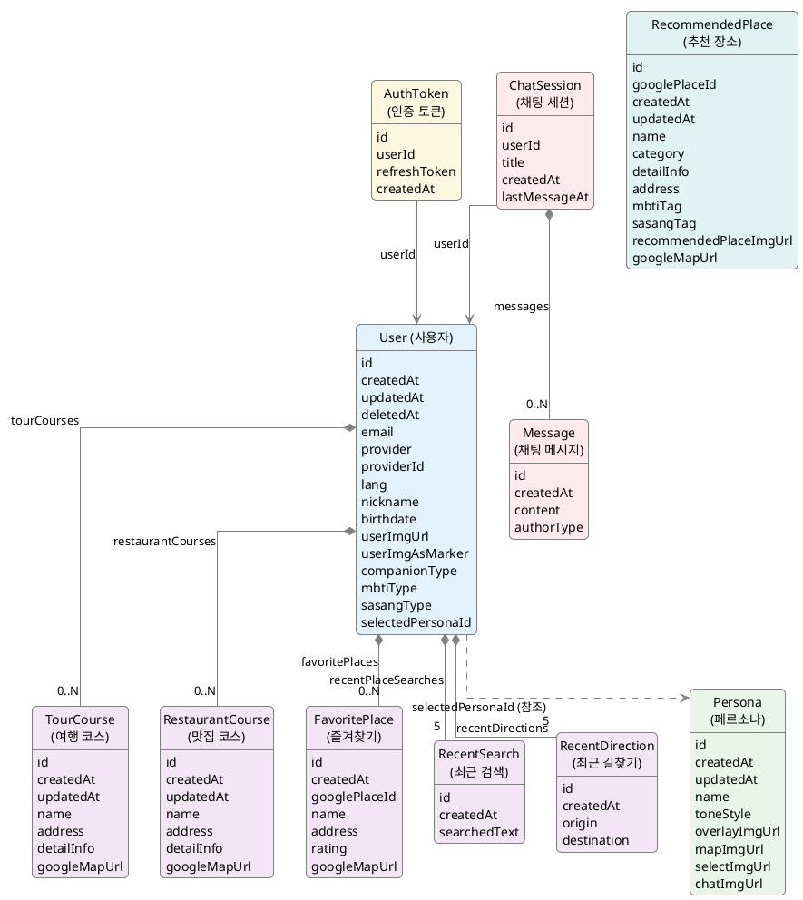

## 데이터
1. user
    1. id
    2. role(RBAC)
    3. createdAt
    4. updatedAt
    5. deletedAt
    6. email
    7. provider
    8. providerId
    9. lang
    10. name
    11. birthdate
    12. userImgUrl
    13. userImgAsMarker(true|false)
    14. companionType
    15. mbtiType
    16. sasangType
    17. selectedPersonaId-선택한 페르소나 
    18. tourCourses(array형태,최대 개수 정하기)
	    1. id
        2. createdAt
        3. updatedAt
        4. name
        5. address
        6. detailInfo-길어지면 분리하거나 Limit걸기
        7. googleMapUrl
    19. restaurantCourses(array형태,최대 개수 정하기)
        1. id
        2. createdAt
        3. updatedAt
        4. name
        5. address
        6. detailInfo-길어지면 분리하거나 Limit걸기
        7. googleMapUrl
    20. favoritePlaces(array형태,최대 개수 정하기)
        1. id
        2. createdAt
        3. googlePlaceId
        4. name
        5. location-GeoJSON(2dsphere)
        6. address
        7. rating
        8. googleMapUrl
    21. recentPlaceSearches(array형태,최근 5개)
        1. id
        2. createdAt
        3. searchedText
    22. recentDirections(array형태,최근 5개)
        1. id
        2. createdAt
        3. origin
        4. destination
2. authToken
	1. id
    2. userId
    3. refreshToken
    4. createdAt
    5. expireAt-TTL적용
3. persona
    1. id
    2. createdAt
    3. updatedAt
    4. name
    5. toneStyle
    6. overlayImgUrl
    7. mapImgUrl
    8. selectImgUrl
    9. chatImgUrl
4. chatSession-채팅 메시지가 너무 길어지면 새로운 세션 생성해야함
    1. id
    2. userId
    3. title-MyInfo에 보여줄때 내용 요약용(선택)
    4. createdAt
    5. lastMessageAt
    6. messages(array형태)
        1. id
        2. createdAt
        3. content
        4. authorType
        5. **messageVector**
5. recommendedPlace
    1. id
    2. googlePlaceId
    3. createdAt
    4. updatedAt
    5. name
    6. category
    7. detailInfo-길어지면 분리하거나 Limit걸기
    8. address
    9. location-GeoJSON(2dsphere)
    10. mbtiTag
    11. sasangTag
    12. recommendedPlaceImgUrl
    13. googleMapUrl
    14. **placeVector**
    15. **mergedTextForVector**

### 페르소나 메인에 띄워주는 방법 선택
1. 프론트에서 실행할때 한번 persona doc의 정보를 가져가서 가지고 있다가 json으로 personaId에 맞는 것만 띄워주는 방식
2. 백에서 DTO에 매번 persona 데이터를 보내주는 방법

### Chat session에 이미지 띄우기
- chat session에 입장할 때 한번만 userImg와 personaImg의 URL을 state로 저장하고 채팅 세션이 끝날때까지만 가지고 있는다

