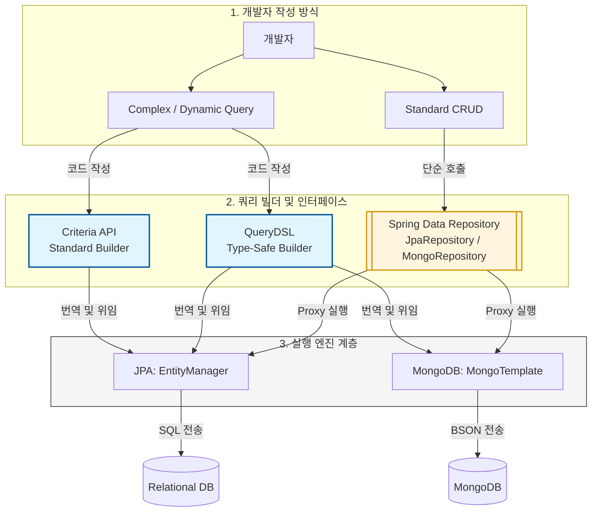

```mermaid
graph TD
    %% 1단계: 개발자 작성 방식
    subgraph UserSpace [1. 개발자 작성 방식]
        User[개발자]
        direction LR
        Standard[Standard CRUD]
        Complex[Complex / Dynamic Query]
    end

    %% 2단계: 추상화 및 빌더 계층
    subgraph BuilderLayer [2. 쿼리 빌더 및 인터페이스]
        Repo[[Spring Data Repository<br/>JpaRepository / MongoRepository]]
        QDSL[QueryDSL<br/>Type-Safe Builder]
        Crit[Criteria API<br/>Standard Builder]
    end

    %% 3단계: 실행기 계층 (Core)
    subgraph EngineLayer [3. 실행 엔진 계층]
        EM[JPA: EntityManager]
        MT[MongoDB: MongoTemplate]
    end

    %% 흐름 연결: 표준 기능
    User --> Standard
    Standard -->|단순 호출| Repo
    Repo -->|Proxy 실행| EM
    Repo -->|Proxy 실행| MT

    %% 흐름 연결: 복잡한 쿼리
    User --> Complex
    Complex -->|코드 작성| QDSL
    Complex -->|코드 작성| Crit
    
    QDSL -->|번역 및 위임| EM
    QDSL -->|번역 및 위임| MT
    Crit -->|번역 및 위임| EM

    %% 최종 DB 전송
    EM -->|SQL 전송| RDB[(Relational DB)]
    MT -->|BSON 전송| MDB[(MongoDB)]

    %% 스타일링
    style Repo fill:#fff4dd,stroke:#d4a017,stroke-width:2px
    style QDSL fill:#e1f5fe,stroke:#01579b,stroke-width:2px
    style Crit fill:#e1f5fe,stroke:#01579b,stroke-width:2px
    style EngineLayer fill:#f5f5f5,stroke:#333
```

- subgraph 
	1. 개발자 작성 방식
	2. 쿼리 빌더 및 인터페이스
	3. 실행 엔진 계층