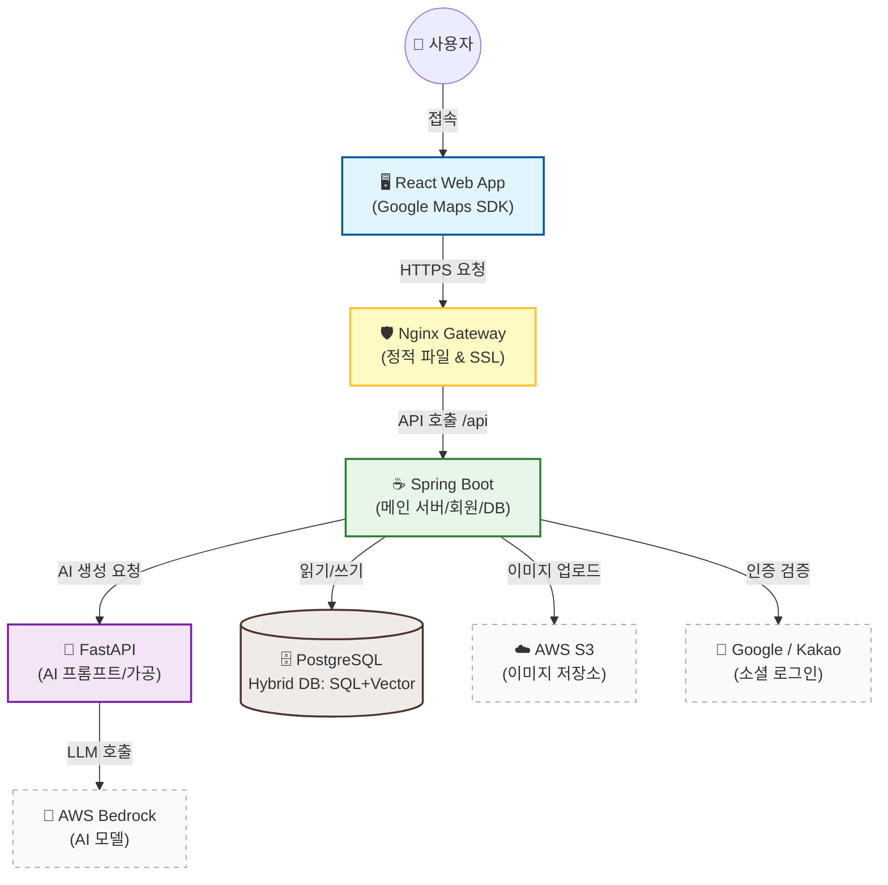

```mermaid
graph TD

    %% 스타일 설정

    classDef client fill:#e1f5fe,stroke:#01579b,stroke-width:2px;

    classDef gateway fill:#fff9c4,stroke:#fbc02d,stroke-width:2px;

    classDef backend fill:#e8f5e9,stroke:#2e7d32,stroke-width:2px;

    classDef ai fill:#f3e5f5,stroke:#7b1fa2,stroke-width:2px;

    classDef db fill:#efebe9,stroke:#4e342e,stroke-width:2px;

    classDef ext fill:#fafafa,stroke:#9e9e9e,stroke-dasharray: 5 5;

  

    %% 1. 클라이언트

    User((👤 사용자)) -->|접속| React["🖥️ React Web App<br/>(Google Maps SDK)"]:::client

  

    %% 2. 게이트웨이

    React -->|HTTPS 요청| Nginx["🛡️ Nginx Gateway<br/>(정적 파일 & SSL)"]:::gateway

  

    %% 3. 백엔드 (Main)

    Nginx -->|API 호출 /api| Spring["☕ Spring Boot<br/>(메인 서버/회원/DB)"]:::backend

  

    %% 4. AI 미들웨어

    Spring -->|AI 생성 요청| FastAPI["🐍 FastAPI<br/>(AI 프롬프트/가공)"]:::ai

  

    %% 5. 데이터 계층

    Spring -->|읽기/쓰기| DB[("🗄️ PostgreSQL<br/>Hybrid DB: SQL+Vector")]:::db

    Spring -->|이미지 업로드| S3["☁️ AWS S3<br/>(이미지 저장소)"]:::ext

    %% 6. 외부 서비스 연동

    FastAPI -->|LLM 호출| Bedrock["🧠 AWS Bedrock<br/>(AI 모델)"]:::ext

    Spring -->|인증 검증| OAuth["🔑 Google / Kakao<br/>(소셜 로그인)"]:::ext
```